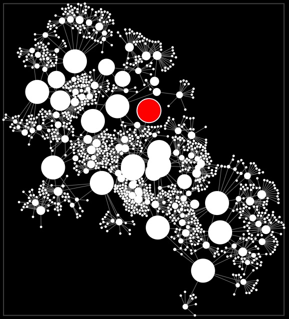

```
      _____  __  _____  __     ____
     / ___/ / / /____/ / /    /    \   FieldKit
    / ___/ /_/ /____/ / /__  /  /  /   (c) 2013, FIELD. All rights reserved.
   /_/        /____/ /____/ /_____/    http://www.field.io

```

Basic building blocks for computational design projects in JavaScript. 
Written in CoffeeScript for browser and server environments.


News
====

v.0.1.0 - 25/03/2013 
--------------------



Finished all core parts of the physics simulation package.
Apart from a few rough edges its already fairly usable as you can see in examples 04 + 05.


12/03/2013
----------

The library is starting to take shape now, among other things these are the main features so far:

[x] Building versions for web and backends.

[x] Installation via NPM.

[x] Physics: integrated a 2D + 3D physics simulation library.
	The main intention here is not to run X million particles
	but to have a library of effectors that can be combined and sequenced easily to create 'intelligent' behaviour
	and/ or to use it as building block for other simulations e.g. Ragdoll physics.

[x] Geometry: 2D + 3D vector math classes.

[x] Geometry: Lines, Splines.

[x] Time: A musical Tempo clock and Timer classes.


03/03/2013
----------

This is my latest attempt at combining useful computational design tools with core packages like Math, Colour and Physics 
into one cohesive library. I gave up on earlier projects either due to a lack of time or because the implementation language
had to change and so on.

As our projects start to converge more and more towards using web tools, 
also in browser-less e.g. installation and generative projects, it seemed like a good idea to give this bundeling attempt another go.

Because of all this, please bear in mind that the codebase will change a lot for the next couple versions!


Installation
============

NPM
---

Install with ```$ npm install fieldkit``` and use the library in your Node/ CommonJS project.

Build
-----

* Clone the git repository ```$ git clone https://github.com/field/FieldKit.js.git```.
* Install the dependent NPM libraries ```npm install```.
* Build the web + npm variants by running ```$ make``` in the project directory.


Examples
========

Having coffee-script installed somewhere on your path, you can start the example file webserver with ```cake examples```. 


Development
===========

Working with a library in development e.g. fieldkit.

Set up NPM to store packages under user folder
```
$ vi ~/.npmrc
prefix = /Users/marcus/Documents/Development/npm
```

Adjust PATH to find binaries installed with NPM
```
$ vi ~/.profile
export PATH=$PATH:/Users/marcus/Documents/Development/npm/bin/
```

Clone library
```
$ git clone git@github.com:field/FieldKit.git
$ cd FieldKit
```

Create NPM package link
```$ npm link```

In Composer project dir - link library into project
```$ npm link fieldkit```

further reading on 
http://justjs.com/posts/npm-link-developing-your-own-npm-modules-without-tears


Credits
=======

Released under the BSD license.  Full details in the included LICENSE file.

(c) 2013, Marcus Wendt <marcus@field.io>

